# Analytics Data Where House

**Analytics Data Where House** (or **ADWH**) is a data engineering and analytics engineering project that implements an open-source modern data platform and analyzes public data related to the housing market in Cook County, Illinois.

# Features

This platform automates curating a local data warehouse of interesting, up-to-date public data sets. It enables users (well, mainly one user, me) to easily add data sets to the warehouse, build analyses that explore and answer questions with current data, and discover existing assets to accelerate exploring new questions.

At present, it uses docker to provision and run:
* a PostgreSQL + PostGIS database as the data warehouse,
* a pgAdmin4 database administration interface,
* Airflow components to orchestrate tasks (note: uses a LocalExecutor),
* dbt to manage data transformation and cleaning tasks, serve and facilitate search of the data dictionary and catalog, 
* great_expectations to ensure data meets  and
* custom python code that makes it easy to implement an ELT pipeline for [any other table hosted by Socrata](http://www.opendatanetwork.com/).

<p align="center" width="100%">
 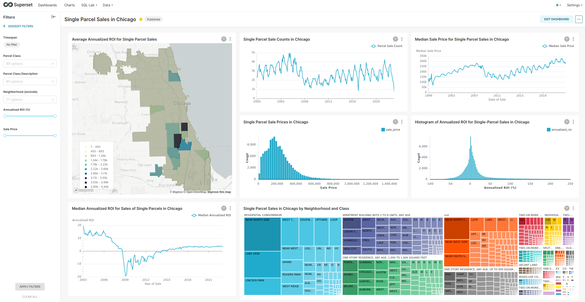
</p>

## Motivation

It takes a tremendous amount of work to create value from data.  Creating value from data is Data only creates value when it enables you to make better decisions or ask better questions, and it can take an overwhelming amount of work before you can start creating value from a new raw data set. To create value from a data set:
* the data set must be relevant to questions of interest
* you must understand the data set's features/columns that are relevant to your questions,
* 

This project seeks to capture 

Data analysis can create value, The data set's features (or columns) must be understood Insights must be timely, 

Chicago and Cook County publish thousands of interesting data sets to their Socrata data portals, , and there are many pitfalls that can negate 
 Converting public data into actionable,  

I like to research before I buy anything, especially if it's a big-ticket item. I've been considering buying a house for a while, but the methods I use for answering questions like "what phone should I buy?" or "how can I make my apartment less drafty in winter" haven't been adequate to answer questions I have about real estate. Fortunately, the real estate market I've grown fond of has the richest public data culture in the US (that I, a data scientist focused on Chicago-related issues, am aware of). This market's Assessor's Office regularly [publishes data](https://datacatalog.cookcountyil.gov/browse?tags=cook%20county%20assessor) I can mine for answers to some of my biggest questions.

# Documentation

You can see documentation for this platform at [https://docs.analytics-data-where-house.dev/](https://docs.analytics-data-where-house.dev/). This project is still under active development and documentation will continue to evolve with the system.

## System Requirements

To use this system, Docker [Engine](https://docs.docker.com/engine/install/) and [Compose (v2.0.0 or higher)](https://docs.docker.com/compose/install/linux/#install-using-the-repository) are the only hard requirements. 

Having python and GNU make on your host system will provide a lot of quality of life improvements (mainly a streamlined setup process and useful makefile recipes), but they're not strictly necessary.


## Usage

After the [system is set up](https://docs.analytics-data-where-house.dev/setup/getting_started/), you can easily add a Socrata data set to the warehouse by

1. Define the `SocrataTable` in `/airflow/dags/sources/tables.py`:

Look up the table's [documentation page](https://datacatalog.cookcountyil.gov/Property-Taxation/Assessor-Parcel-Sales/wvhk-k5uv) on the web and get the `table_id` from the URL (it will be nine characters long, all lowercase and with a hyphen in the middle). Use that `table_id` value, along with a sensible name for the table and [cron expressions](https://crontab.cronhub.io/) that indicates how frequently the system should check for data updates) to define a SocrataTable instance for the table.

```python
COOK_COUNTY_PARCEL_SALES = SocrataTable(
    table_id="wvhk-k5uv",
    table_name="cook_county_parcel_sales",
    schedule="0 6 4 * *",
)
```
Note: It's a convention in python to capitalize the names of constants, and as the `table_id` and `table_name` for a data set should be constant, I use the capitalized `table_name` as the name of the data set's `SocrataTable` instance variable.


2. Create a DAG in a file in `/airflow/dags/` based on the `update_data_raw_cook_county_parcel_sales` DAG below:

After copying the code into a new file, you only have to make changes to the 4 lines numbered below:
1: Replace `COOK_COUNTY_PARCEL_SALES` with the name of the `SocrataTable` instance variable from `tables.py`,
2: change the tags to reflect this data set,
3: change the name of this DAG's function name to reflect this data set, and
4: call that DAG function.

```python
# This is the full file /airflow/dags/cook_county/update_raw_cook_county_parcel_sales.py
import datetime as dt
import logging

from airflow.decorators import dag

from tasks.socrata_tasks import update_socrata_table
from sources.tables import COOK_COUNTY_PARCEL_SALES as SOCRATA_TABLE   ### 1.

task_logger = logging.getLogger("airflow.task")


@dag(
    schedule=SOCRATA_TABLE.schedule,
    start_date=dt.datetime(2022, 11, 1),
    catchup=False,
    tags=["cook_county", "parcels", "fact_table", "data_raw"],        ### 2.
)
def update_data_raw_cook_county_parcel_sales():                       ### 3.
    update_1 = update_socrata_table(
        socrata_table=SOCRATA_TABLE,
        conn_id="dwh_db_conn",
        task_logger=task_logger,
    )
    update_1
update_data_raw_cook_county_parcel_sales()                            ### 4.
```

Congratulations! You just defined a new data pipeline! After you unpause and run this DAG in the Airflow Web UI, the system will automatically build that data pipeline, add that data set to the warehouse, and update that data set on the schedule indicated in the `SocrataTable` instance.

## Socrata Table Ingestion Flow

The Update-data DAGs for (at least) Socrata tables follow the pattern below:
* Check the metadata of the table's data source (via [api](https://socratametadataapi.docs.apiary.io/) if available, or if not, by [scraping](https://www2.census.gov/) where possible)
  * If the local data warehouse's data is stale:
    * download and ingest all new records into a temporary table,
    * identify new records and updates to prior records, and
    * add any new or updated records to a running table of all distinct records
  * If the local data warehouse's data is as fresh as the source:
    * update the freshness-check-metadata table and end

<p align="center" width="100%">
 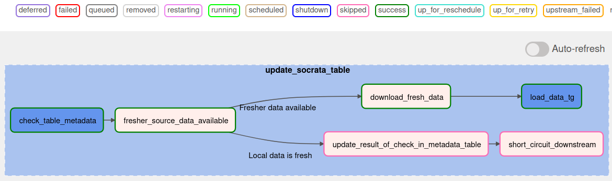
</p>

Before downloading potentially gigabytes of data, we check the data source's metadata to determine if the source data has been updated since the most recent successful update of that data in the local data warehouse. Whether there is new data or not, we'll log the results of that check in the data_warehouse's `metadata.table_metadata` table. 

<p align="center" width="100%">
 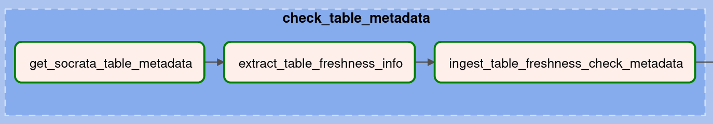
</p>

<p align="center" width="100%">
 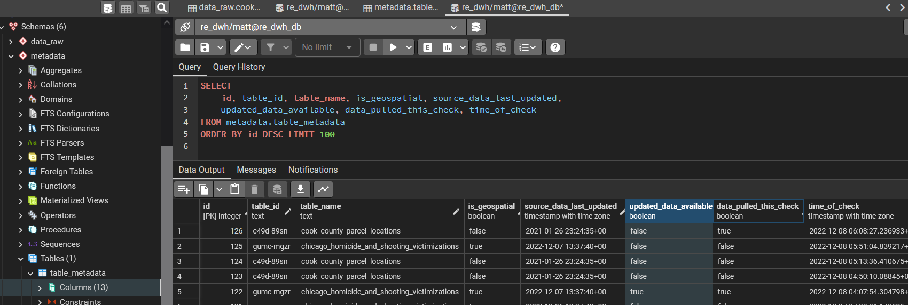
</p>

If the data source's data is fresher than the data in the local data warehouse, the system downloads the entire table from the data source (to a file in the Airflow-scheduler container) and then runs the `load_data_tg` TaskGroup, which:
1. Loads it into a "temp" table (via the appropriate data-loader TaskGroup).

<p align="center" width="100%">
 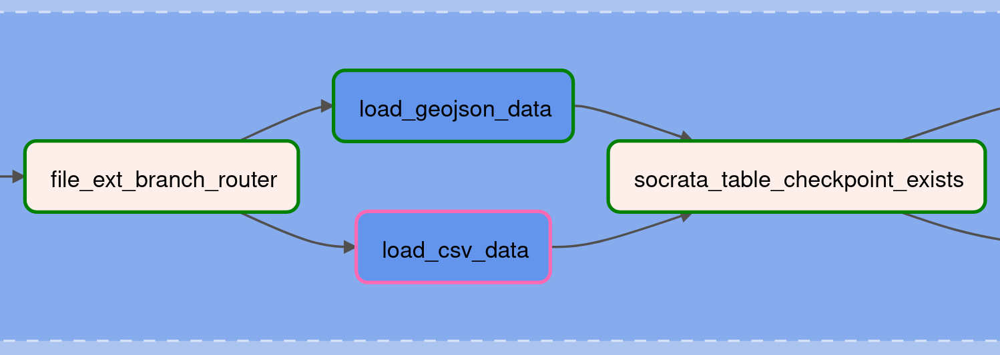
</p>

2. Creates a persisting table for this data set in the `data_raw` schema if the data set is a new addition to the warehouse.
3. Checks if the initial dbt data_raw deduplication model exists, and if not, the `make_dbt_data_raw_model` task automatically generates a data-set-specific dbt data_raw model file.

<p align="center" width="100%">
 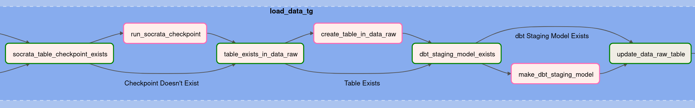
</p>

4. Compares all records from the latest data set (in the "temp" table) against all records previously added to the persisting `data_raw` table. Records that are entirely new or are updates of prior records (i.e., at least one source column has a changed value) are appended to the persisting `data_raw` table.
  * Note: updated records do not replace the prior records here. All distinct versions are kept so that it's possible to examine changes to a record over time.
5. The `metadata.table_metadata` table is updated to indicate the table in the local data warehouse was successfully updated on this freshness check.

<p align="center" width="100%">
 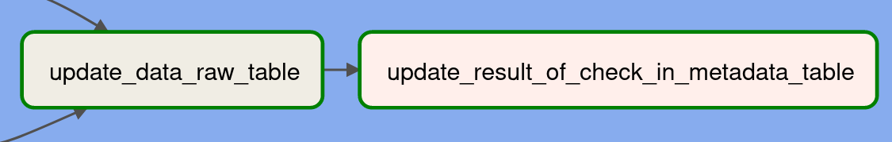
</p>

Those tasks make up the `load_data_tg` Task Group.

<p align="center" width="100%">
 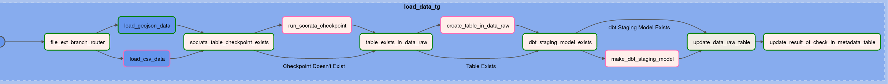
</p>

If the local data warehouse has up-to-date data for a given data source, we will just record that finding in the metadata table and end the run.

<p align="center" width="100%">
 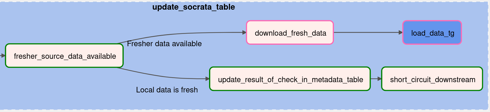
</p>

### Data Loader task_groups

Tables with geospatial features/columns will be downloaded in the .geojson format (which has a much more flexible structure than .csv files), while tables without geospatial features (ie flat tabular data) will be downloaded as .csv files. Different code is needed to correctly and efficiently read and ingest these different formats. So far, this platform has implemented data-loader TaskGroups to handle .geojson and .csv file formats, but this pattern is easy to extend if other data sources only offer other file formats.

<p align="center" width="100%">
 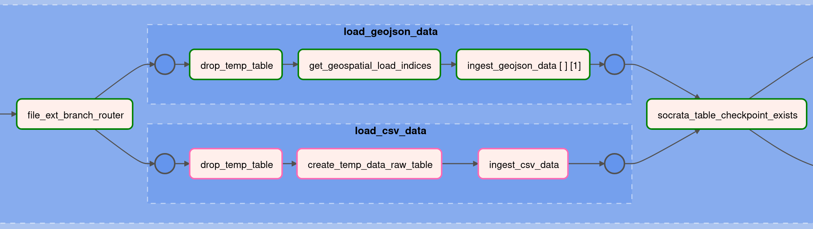
</p>

Many public data tables are exported from production systems, where records represent something that can change over time. For example, in this [building permit table](https://data.cityofchicago.org/Buildings/Building-Permits/ydr8-5enu), each record represents an application for a building permit. Rather than adding a new record any time the application process moves forward (e.g., when a fee was paid, a contact was added, or the permit gets issued), the original record gets updated. After this data is updated, the prior state of the table is gone (or at least no longer publicly available). This is ideal for intended users of the production system (i.e., people involved in the process who have to look up the current status of a permit request). But for someone seeking to understand the process, keeping all distinct versions or states of a record makes it possible to see how a record evolved. So I've developed this workflow to keep the original record and all distinct updates for (non "temp_") tables in the `data_raw` schema.

This query shows the count of new or updated records grouped by the data-publication DateTime when the record was new to the local data warehouse.

<p align="center" width="100%">
 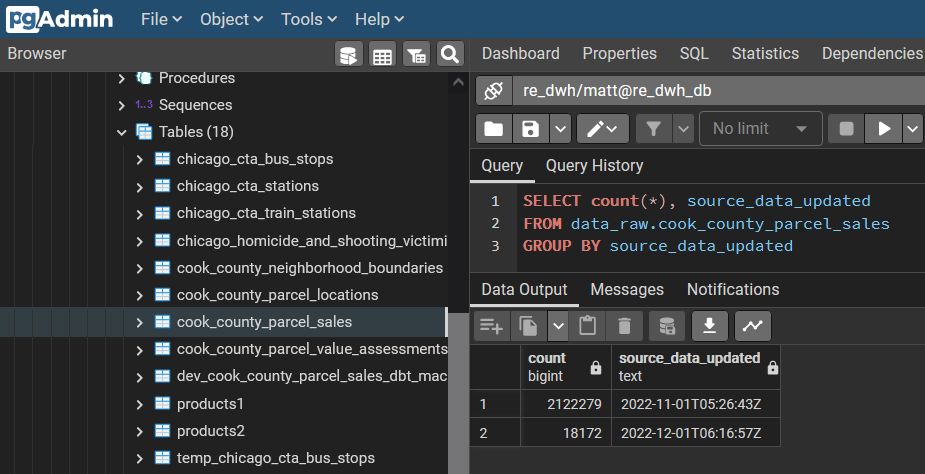
</p>


### Serving dbt Data Documentation and Discovery UI 

To generate and serve documentation for the data transformations executed by dbt, run the command below, and after the doc server has started up, go to [http://localhost:18080](http://localhost:18080) to explore the documentation UI.

The documentation will be mainly based on the sources, column names, and descriptions recorded in the `.yml` file in the `.../dbt/models/...` directories with table-or-view-producing dbt scripts.

```bash
user@host:.../your_local_repo$ make serve_dbt_docs

```
<p align="center" width="100%">
  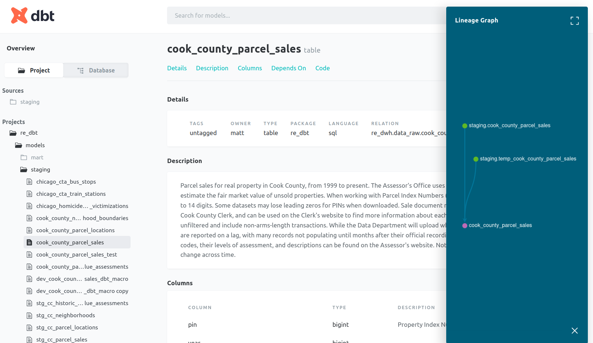
</p>

## Developing queries and exploring data in pgAdmin4

pgAdmin4 is a very feature-rich environment and makes it very convenient to test out queries or syntax and see the result.

<p align="center" width="100%">
  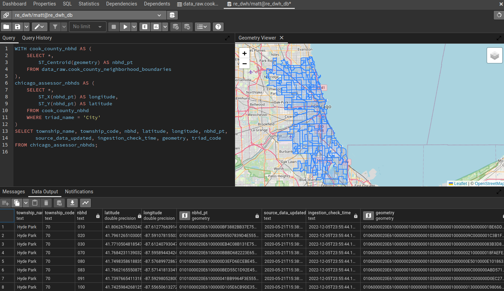
</p>

# Data Validation with `great_expectations`
## Setting up New Data Sources

This project already configures a [`great_expectations` Datasource](https://docs.greatexpectations.io/docs/terms/datasource/) and [Data Connectors](https://docs.greatexpectations.io/docs/terms/data_connector) for the included `dwh_db` database, but the Analytics-Data-Where-House documentation has a walkthrough on [setting up a new Datasource](https://docs.analytics-data-where-house.dev/user_guide/making_expectation_suites/#setting-up-new-data-sources).


## Generating a Suite of Expectations for a Data Set

To validate data, `great_expectations` first needs a suite of expectations for that data. The ADWH docs also include a walkthrough showing the process of [setting up a suite of expectations](https://docs.analytics-data-where-house.dev/user_guide/making_expectation_suites/#generating-a-suite-of-expectations-for-a-data-set).

## Configuring a Checkpoint and Validating a Data Set

Now that you have generated a suite of expectations, you should check that the data meets those expectations by configuring and running a **checkpoint**. You'll very likely discover that the expectations generated by `great_expectations` data profiling tools on a small batch of data will need some tweaks.

To see a walkthrough of this process, including the steps to revise expectations, the [ADWH documentation has you covered](https://docs.analytics-data-where-house.dev/user_guide/making_expectation_suites/#configuring-a-checkpoint-and-validating-a-data-set)!

# Troubleshooting Notes

While developing workflows, occassionally I'll run into permissions issues where Airflow tries to create things in a location that was created automatically outside of the specified volume locations or something and I've had to change (take) ownership of the location (from outside of the container) via a `chown` command like the one below (where I'm `-R`ecursively taking ownership of the `dbt/` directory).

```bash
sudo chown -R $USER:$USER dbt/
```

Additionally, if you run into issues while debugging a dbt model where you're making changes to the model but getting the same error every time, try running the command below (to clean out the previously compiled dbt models and installed packages, then reinstall packages) and run the relevant DAG again to see if things update.

```bash
make clean_dbt
```
