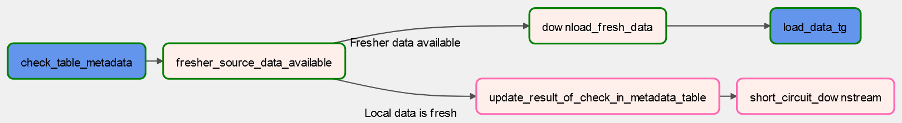
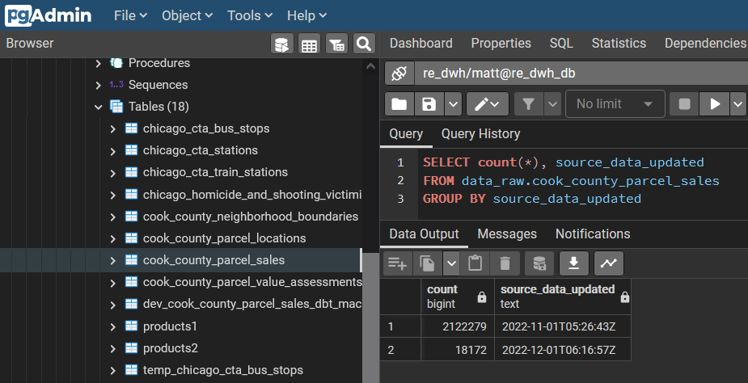
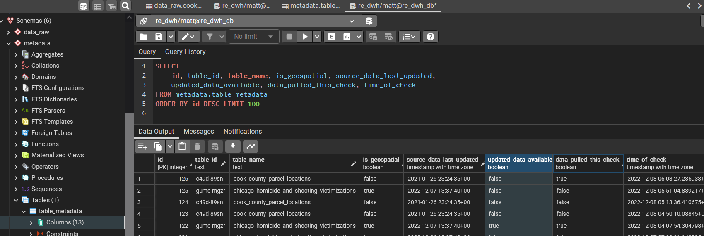
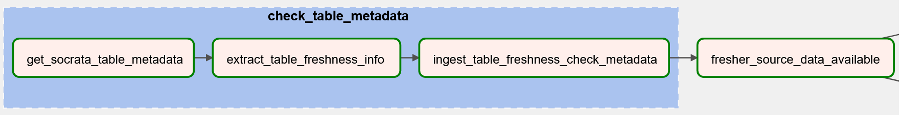
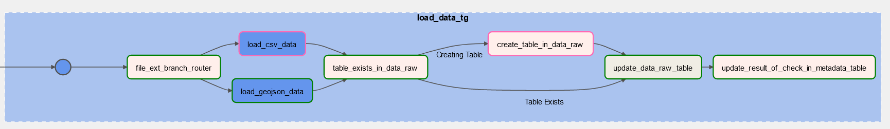
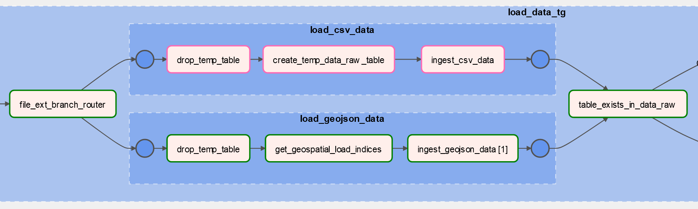
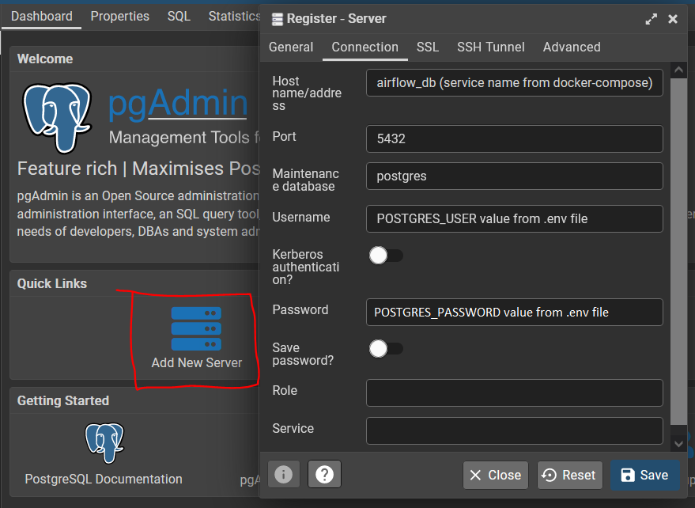
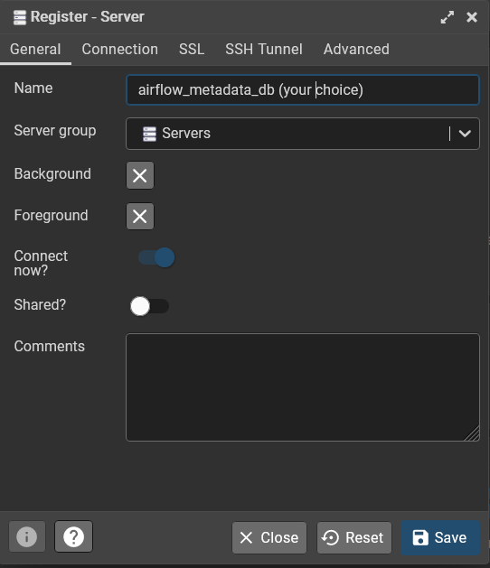
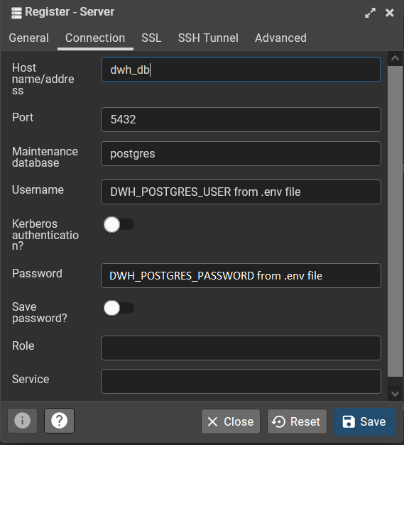
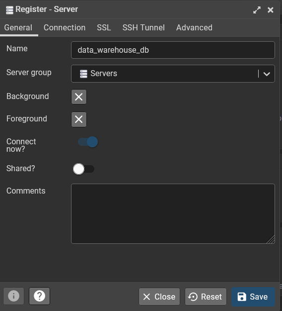

# Analytics Data Where House

This platform automates curation of a local data warehouse of interesting up-to-date public data sets and enables me to ask and answer deeper questions.

At present, it uses docker to provision and run:
* a PostgreSQL + PostGIS database as the data warehouse,
* a pgAdmin4 database administration interface,
* Airflow components to orchestrate tasks (note: uses a LocalExecutor),
* dbt to manage data transformation and cleaning tasks, and
* custom python code that makes it easy to implement an ELT pipeline for [any other table hosted by Socrata](http://www.opendatanetwork.com/).

## Motivation
I like to do my research before I buy anything, especially if it's a big ticket item. I've been considering buying a house for a while, but the methods I use for answering questions like "what phone should I buy?" or "how can I make my apartment less drafty in winter" haven't been adequate to answer the questions I have about real estate. Fortunately, the real estate market I've grown fond of has the richest public data culture in the US (that I, a data scientist focused on Chicago-related issues, am aware of), and this market's Assessor's Office regularly [publishes data](https://datacatalog.cookcountyil.gov/browse?tags=cook%20county%20assessor) I can mine for answers to some of my biggest questions.

## Ingestion Flow














## Usage

Preprequisites:
To use this system, Docker is the only absolutely necessary prerequisite.

Having `GNU make` and/or core python on your host system will enable you to use included `makefile` recipes and scripts to streamline setup and common operations, but you could get by without them (although you'll have to figure more out).

### Setting up credentials
After cloning this repo and `cd`ing into your local, run this `make` command and respond to prompts the the requested values,

```bash
make make_credentials
```

#### Generating a Frenet Key to use as env var AIRFLOW__CORE__FERNET_KEY
To get a proper frenet key for the `AIRFLOW__CORE__FERNET_KEY` environment variable, the best way I know of involves the `cryptography` module, which isn't a built-in python module, but it is pretty common and it's easy enough to `pip install` or `conda install` into a `venv` or `conda env` if it hasn't already been installed as a dependency for something else.

```python
from cryptography.fernet import Fernet

fernet_key = Fernet.generate_key()
print(fernet_key.decode()) # your fernet_key
```
then copy that value and paste it into the appropriate field in the `.env` file in the same directory as this README.md file.


### Initializing the system

On the first startup of the system (and after setting your credentials), run the commands below to 1) build the platform's docker images, and 2) initialize the airflow metadata database. 

```bash
user@host:.../your_local_repo$ make build
user@host:.../your_local_repo$ make init_airflow
```

These commands only need to be run on first startup (although you will need to rebuild if you make any changes to a `Dockerfile` or a `requirements.txt` file). 

### Starting up the system

Run this command to startup the platform

```bash
user@host:.../your_local_repo$ make startup
```

After systems have started up, you can access:
* The pgAdmin4 database administration UI at [http://localhost:5678](http://localhost:5678)
  * Log in using the `PGADMIN_DEFAULT_EMAIL` and `PGADMIN_DEFAULT_PASSWORD` credentials from your `.env` file. 
* The Airflow UI at [http://localhost:8080](http://localhost:8080)
  * Log in using the `_AIRFLOW_WWW_USER_USERNAME` and `_AIRFLOW_WWW_USER_PASSWORD` credentials from your `.env` file.

### Setting up database connections in pgAdmin4

The pgAdmin4 UI makes it very easy to explore your data, inspect database internals, and make manual changes while developing features, but before you can make use of this excellent interface, you have to set a connection to a database. This platform uses two separate databases: one as a backend for Airflow, and the other as the data warehouse database.

To create a new connection, start by clicking the "Add New Server" button (you might have to click the "Servers" line in the lefthand tray first). On the **Connection** page, enter the appropriate credential values from your `.env` file,



and on the **General** tab, enter a display name for that connection (**airflow_metadata_db** shown)



Repeat the process to connect to the data warehouse database, using the appropriate (and different from above) credential values from your `.env` file,



 

### Setting up Airflow Connections to Data Sources

There are several method you can use to set up connections to data sources that the Airflow executor can use to extract, load, or transform data.

* Environment variables:
  * The naming convention is AIRFLOW_CONN_{CONN_ID}, (all uppercase; single underscores surrounding CONN). 
  * Example: The env-var name of AIRFLOW_CONN_MY_PROD_DB will have the connection_id `my_prod_db`.
  * The value for this env-var will have the form '<conn-type>://<login>:<password>@<host>:<port>/<schema>?param1=val1&param2=val2&...'

You can also create a connection through the admin interface of the web UI by logging in, going to **Admin > Connections** then click the **Plus** sign to add a new connection.
* Connection Id (conn_id): your choice; you'll use this when referencing this connection in DAGs,
* Connection Type: Postgres,
* Host: be the name of the `docker-compose.yml` service for your data warehouse database,
* Schema: this will be the name of the database as set in `.dwh.env` as `POSTGRES_DB`
    * Note: this "schema" field has nothing to do with postgres schemas; the word "schema" was foolishly overloaded with several different database-related meanings),
* Login: the `POSTGRES_USER` env-var set in `.dwh.env`,
* Password: the `POSTGRES_PASSWORD` env-var set in `.dwh.env`,
* Port: the internal port number that the data warehouse database is using (as defined in `docker-compose.yml`, most likly 5432)

[Further information on connections](https://airflow.apache.org/docs/apache-airflow/stable/howto/connection.html).

### Developing DAGs

DAGs put or developed in the `/<repo>/airflow/dags/` directory will quickly be available through the web UI and can be manually triggered or run there.

At present, a local mount is created at `/<repo>/data_raw` (host-side) to `/opt/airflow/data_raw` (container-side), so changes you make to a DAG from your host machine will be (nearly immediately) available you can develop.

### Serving dbt Data Documentation and Discovery UI 

To generate and serve documentation for the data transformations executed by dbt, run the command below, and after the doc server has started up, go to [http://localhost:18080](http://localhost:18080) to explore the documentation UI.

```bash
user@host:.../your_local_repo$ make serve_dbt_docs
```

### Specifying, installing, and updating dbt packages
 
Create a file named `packages.yml` in your dbt project directory and specify any packages you want to use in your project in the format shown below (or as shown in the [documentation](https://docs.getdbt.com/docs/build/packages))

```yml
packages:
  - package: dbt-labs/dbt_utils
    version: 0.9.2
```

Then, after specifying packages and versions to use, run this command to install packages.

```bash
user@host:.../your_local_repo$ make update_dbt_packages
01:33:04  Running with dbt=1.3.0
01:33:05  Installing dbt-labs/dbt_utils
01:33:05    Installed from version 0.9.2
01:33:05    Up to date!
```


Notes:
* In the docker-compose.yml file from Airflow's docker quick start guide, the system uses the CeleryExecutor rather than the LocalExecutor. If you regularly need to run so many concurrent tasks that all allocated CPU cores are in use and waiting tasks must be queued until hardware is free, then the CeleryExecutor is a necessary complexity (as it allows you to split up execution over multiple servers). But if your workflows don't simultaneously consume all CPU cores, then the LocalExecutor is probably adequate.
  * If you switch to using the LocalExecutor, you can also remove the Redis bits from the docker-compose, as the Redis service is just the task queue.
  * You can also remove the `airflow-worker` and `flower` services, which are also only used for managing `celery`.


