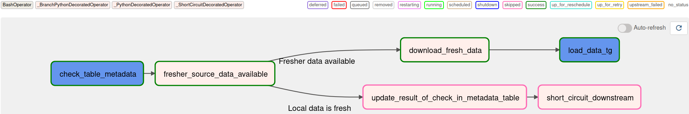
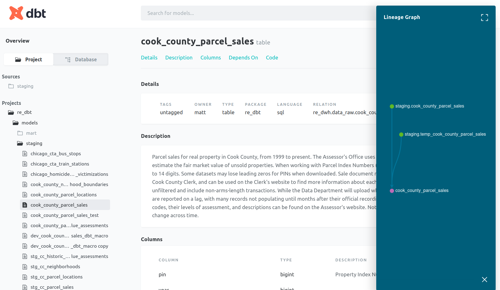
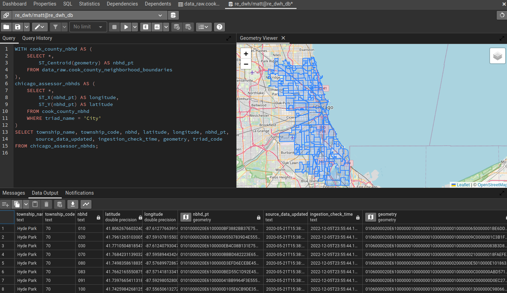

# Analytics Data Where House

This platform automates curation of a local data warehouse of interesting up-to-date public data sets and enables me to ask and answer deeper questions.

At present, it uses docker to provision and run:
* a PostgreSQL + PostGIS database as the data warehouse,
* a pgAdmin4 database administration interface,
* Airflow components to orchestrate tasks (note: uses a LocalExecutor),
* dbt to manage data transformation and cleaning tasks, and
* custom python code that makes it easy to implement an ELT pipeline for [any other table hosted by Socrata](http://www.opendatanetwork.com/).

## Motivation
I like to do my research before I buy anything, especially if it's a big ticket item. I've been considering buying a house for a while, but the methods I use for answering questions like "what phone should I buy?" or "how can I make my apartment less drafty in winter" haven't been adequate to answer the questions I have about real estate. Fortunately, the real estate market I've grown fond of has the richest public data culture in the US (that I, a data scientist focused on Chicago-related issues, am aware of), and this market's Assessor's Office regularly [publishes data](https://datacatalog.cookcountyil.gov/browse?tags=cook%20county%20assessor) I can mine for answers to some of my biggest questions.

## Socrata Table Ingestion Flow

The Update-data DAGs for (at least) Socrata tables follow the pattern below:
* Check the metadata of the table's data source (via [api](https://socratametadataapi.docs.apiary.io/) if available, or if not, by [scraping](https://www2.census.gov/) where possible)
  * If the local data warehouse's data is stale:
    * download and ingest all new records into a temporary table,
    * identify which records are new or are updates to prior records, and
    * add any new or updated records to a running table of all distinct records
  * If the local data warehouse's data is as fresh as the source:
    * update the freshness-check-metadata table and end

<p align="center" width="100%">
 
</p>

Before downloading potentially gigabytes of data, we check the data source's metadata to determine if the source data has been updated since the most recent successful update of that data in the local data warehouse. Whether there is fresh data or not, we'll log the results of that check in the data_warehouse's `metadata.table_metadata` table. 

<p align="center" width="100%">
 
</p>

<p align="center" width="100%">
 
</p>

If the data source's data is fresher than the data in the local data warehouse, the system downloads the full table from the data source (to a file in the Airflow-scheduler container) and then runs the `load_data_tg` TaskGroup, which:
1. loads it into a "temp" table (via the appropriate data-loader TaskGroup),
2. creates a persisting table for this data set in the `data_raw` schema if the data set is a new addition to the warehouse,
3. compares all records from the latest data set (in the "temp" table) against all records previously added to the persisting `data_raw` table for all original columns, selects records that are completely new or are updated versions of prior records, and appends those new or updated records to the persisting `data_raw` table.
  * Note: updated records do not replace the prior records here. All distinct versions are kept so that it's possible to examine changes to a record over time.
4. The `metadata.table_metadata` table is updated to indicate the table in the local data warehouse was successfully updated on this freshness check.

<p align="center" width="100%">
 
</p>

Tables with geospatial features/columns will be downloaded in the .geojson format (which has a much more flexible structure than .csv files), while tables without geospatial features (ie flat tabular data) will be downloaded as .csv files. Different code is needed to correctly and efficiently read and ingest these different formats. So far, this platform has implemented data-loader TaskGroups to handle .geojson and .csv file formats, but this pattern is easy to extend if other data sources only offer other file formats.

<p align="center" width="100%">
 
</p>

Many public data tables are exported from production systems, where records represent something that can change over time. For example, in this [building permit table](https://data.cityofchicago.org/Buildings/Building-Permits/ydr8-5enu), each record represents an application for a building permit, and rather than adding a new record any time the process moved forward (e.g. a fee was paid, or a contact was added, or the permit gets issued), the original record gets updated. After this data is updated, the prior state of the table is gone (or at least no longer publicly available), which is ideal for people involved in the process who have to look up the current status of a permit request, but for someone seeking to learn about the process, it's useful to keep the original record as well as all distinct updates to the record.

This system is built to have this updating strategy for tables in the `data_raw` schema, and this query shows the count of new or updated records grouped by the data-publication datetime when the record was new to the local data warehouse.

<p align="center" width="100%">
 
</p>

## Usage

Preprequisites:
To use this system, Docker is the only absolutely necessary prerequisite.

Having `GNU make` and/or core python on your host system will enable you to use included `makefile` recipes and scripts to streamline setup and common operations, but you could get by without them (although you'll have to figure more out).

### Setting up credentials
After cloning this repo and `cd`ing into your local, run this `make` command and respond to prompts the the requested values,

```bash
make make_credentials
```

#### Generating a Frenet Key to use as env var AIRFLOW__CORE__FERNET_KEY
To get a proper frenet key for the `AIRFLOW__CORE__FERNET_KEY` environment variable, the best way I know of involves the `cryptography` module, which isn't a built-in python module, but it is pretty common and it's easy enough to `pip install` or `conda install` into a `venv` or `conda env` if it hasn't already been installed as a dependency for something else.

```python
from cryptography.fernet import Fernet

fernet_key = Fernet.generate_key()
print(fernet_key.decode()) # your fernet_key
```
then copy that value and paste it into the appropriate field in the `.env` file in the same directory as this README.md file.


### Initializing the system

On the first startup of the system (and after setting your credentials), run the commands below to
1. build the platform's docker images, and initialize the airflow metadata database,
2. start up the system in detached mode (so that you don't have to open another terminal), and
3. create the `metadata` and `data_raw` schemas and the `metadata.table_metadata` table in your data warehouse database.

```bash
user@host:.../your_local_repo$ make initialize_system
user@host:.../your_local_repo$ make quiet_startup
user@host:.../your_local_repo$ make create_warehouse_infra
```

These commands only need to be run on first startup (although you will need to run `make build_images` to rebuild images if you make any changes to any of the `Dockerfile`s or add/remove packages from a `requirements.txt` file).

### Starting up the system

Run this command to startup the platform

```bash
user@host:.../your_local_repo$ make startup
```

After systems have started up, you can access:
* The pgAdmin4 database administration UI at [http://localhost:5678](http://localhost:5678)
  * Log in using the `PGADMIN_DEFAULT_EMAIL` and `PGADMIN_DEFAULT_PASSWORD` credentials from your `.env` file. 
* The Airflow UI at [http://localhost:8080](http://localhost:8080)
  * Log in using the `_AIRFLOW_WWW_USER_USERNAME` and `_AIRFLOW_WWW_USER_PASSWORD` credentials from your `.env` file.

### Setting up database connections in pgAdmin4

The pgAdmin4 UI makes it very easy to explore your data, inspect database internals, and make manual changes while developing features, but before you can make use of this excellent interface, you have to set a connection to a database. This platform uses two separate databases: one as a backend for Airflow, and the other as the data warehouse database.

To create a new connection, start by clicking the "Add New Server" button (you might have to click the "Servers" line in the lefthand tray first). On the **Connection** page, enter the appropriate credential values from your `.env` file,

<p align="center" width="100%">
  
</p>


and on the **General** tab, enter a display name for that connection (**airflow_metadata_db** shown)

<p align="center" width="100%">
  
</p>

Repeat the process to connect to the data warehouse database, using the appropriate (and different from above) credential values from your `.env` file,

<p align="center" width="100%">
  
 
</p>

### Developing DAGs

DAGs put or developed in the `/<repo>/airflow/dags/` directory will quickly be available through the web UI and can be manually triggered or run there.

At present, a local mount is created at `/<repo>/data_raw` (host-side) to `/opt/airflow/data_raw` (container-side), so changes you make to a DAG from your host machine will be (nearly immediately) available you can develop.

### Serving dbt Data Documentation and Discovery UI 

To generate and serve documentation for the data transformations executed by dbt, run the command below, and after the doc server has started up, go to [http://localhost:18080](http://localhost:18080) to explore the documentation UI.

The documentation will be mainly based on the sources, column names, and descriptions recorded in the `.yml` file in the `.../dbt/models/...` directories with table-or-view-producing dbt scripts.

```bash
user@host:.../your_local_repo$ make serve_dbt_docs

```
<p align="center" width="100%">
  
</p>

### Specifying, installing, and updating dbt packages
 
Create a file named `packages.yml` in your dbt project directory and specify any packages you want to use in your project in the format shown below (or as shown in the [documentation](https://docs.getdbt.com/docs/build/packages))

```yml
packages:
  - package: dbt-labs/dbt_utils
    version: 0.9.2
```

Then, after specifying packages and versions to use, run this command to install packages.

```bash
user@host:.../your_local_repo$ make update_dbt_packages
01:33:04  Running with dbt=1.3.0
01:33:05  Installing dbt-labs/dbt_utils
01:33:05    Installed from version 0.9.2
01:33:05    Up to date!
```

## Developing queries and exploring data in pgAdmin4

pgAdmin4 is a very feature-rich environment and makes it very convenient to test out queries or syntax and see the result.

<p align="center" width="100%">
  
</p>

